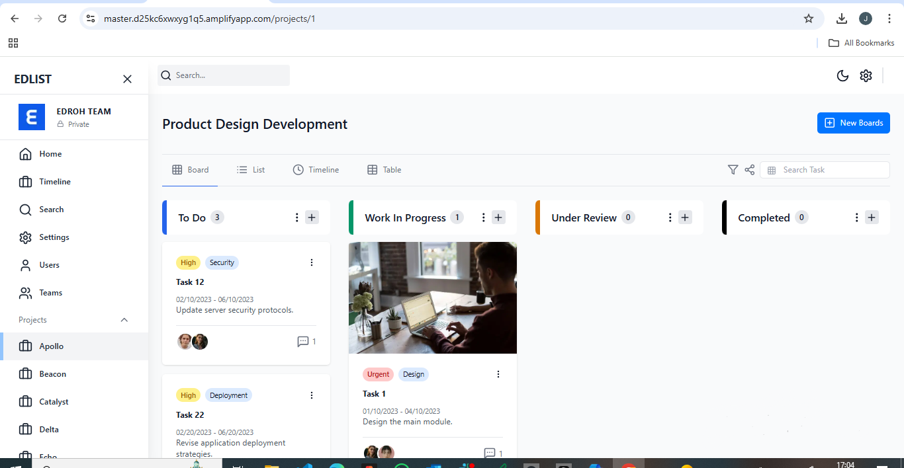
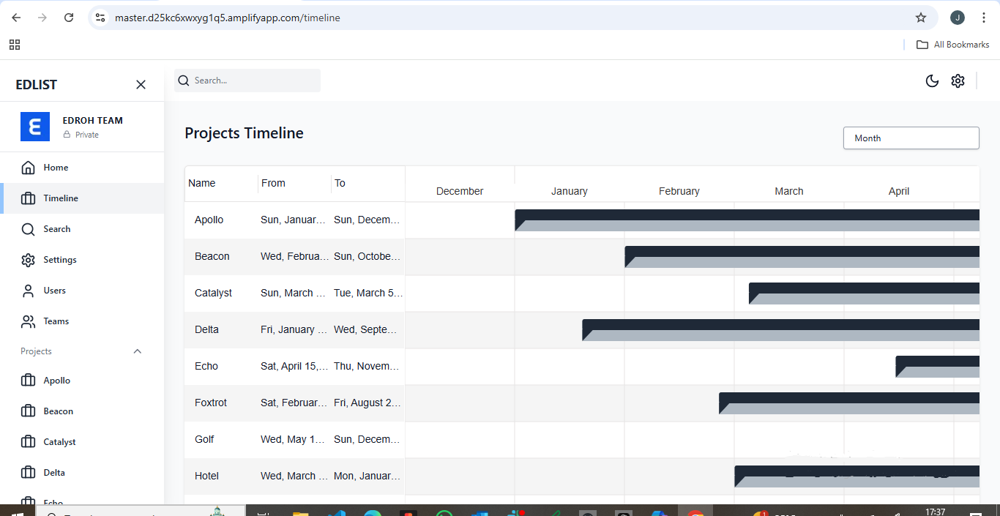
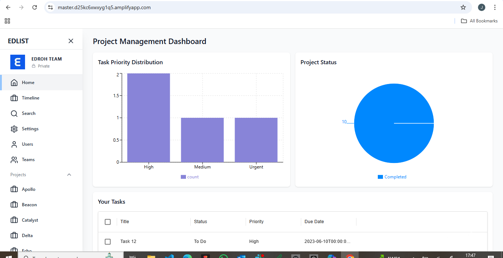

# Projct Management System

Welcome to **Projct Management System**! This project helps users manage tasks and monitor progress efficiently. It features an intuitive **Project Board** and a comprehensive **Dashboard** for analytics.

---

## 📋 Project Board

The **Project Board** allows you to manage tasks, track statuses, and collaborate with your team seamlessly.

### Preview:



> _The Project Board includes columns like "To Do," "In Progress," and "Completed," with drag-and-drop functionality to organize tasks._

---

## 📊 Timeline view

The **time-line view** displays how the various projects and tasks are scheduleed with a gantt chart to give the impression of how long each project takes and how they overlap with other projects.

### Preview:



> _The Dashboard features charts, metrics, and recent activity summaries, offering a quick overview of the project's performance._

---

## 📊 Dashboard

The **Dashboard** provides key insights and visual representations of your data. It's designed to help you stay on top of your progress and KPIs.

### Preview:



> _The Dashboard features charts, metrics, and recent activity summaries, offering a quick overview of the project's performance._

---

## 🚀 Live Demo

[View Live Site](https://master.d25kc6xwxyg1q5.amplifyapp.com/)

---

## 🛠️ Installation

To run this project locally, follow these steps:

1. Clone the repository:
   ```bash
   git clone <repo link>
   cd into client and npm i
   cd into server and npm i
   npm prisma generate
    run a migration
    seed the db with the npm run seed
   ```

## 🤝 Contributing

We welcome contributions! To contribute:

Fork the repository.
Create a new branch for your feature or fix:
bash
Copy code
git checkout -b feature/your-feature-name
Commit your changes:
bash
Copy code
git commit -m "Add a brief description of your changes"
Push your branch:
bash
Copy code
git push origin feature/your-feature-name
Open a pull request.
Please read our Contributing Guide for more details.

## 📝 License

This project is licensed under the MIT License. Feel free to use it as you see fit!

## 💬 Contact

For any questions, feel free to reach out:

# Name: Denis Gichana

#Email: denisgichana162@email.com

# GitHub: https://github.com/dennoh-mzoefu
